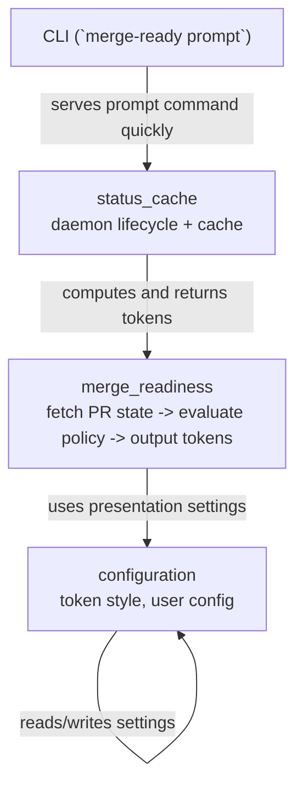

# contexts

`merge-ready` は責務ごとに 3 つのコンテキストへ分割されています。
各コンテキストは `domain / application / infrastructure / interface` のレイヤーで構成され、
関心事を分離した設計になっています。

## コンテキスト一覧

- `configuration`: 設定の取得・更新を担当
- `merge_readiness`: PR のマージ可否判定を担当
- `status_cache`: デーモンとキャッシュによる低遅延応答を担当

## 関係図（責務のつながり）

## 補足

- `merge_readiness` は判定ロジックの中核で、表示用トークンを生成します。
- `status_cache` はその結果をキャッシュして、プロンプト呼び出しを高速化します。
- `configuration` はトークン表示や挙動に関わる設定を提供し、他コンテキストから参照されます。
